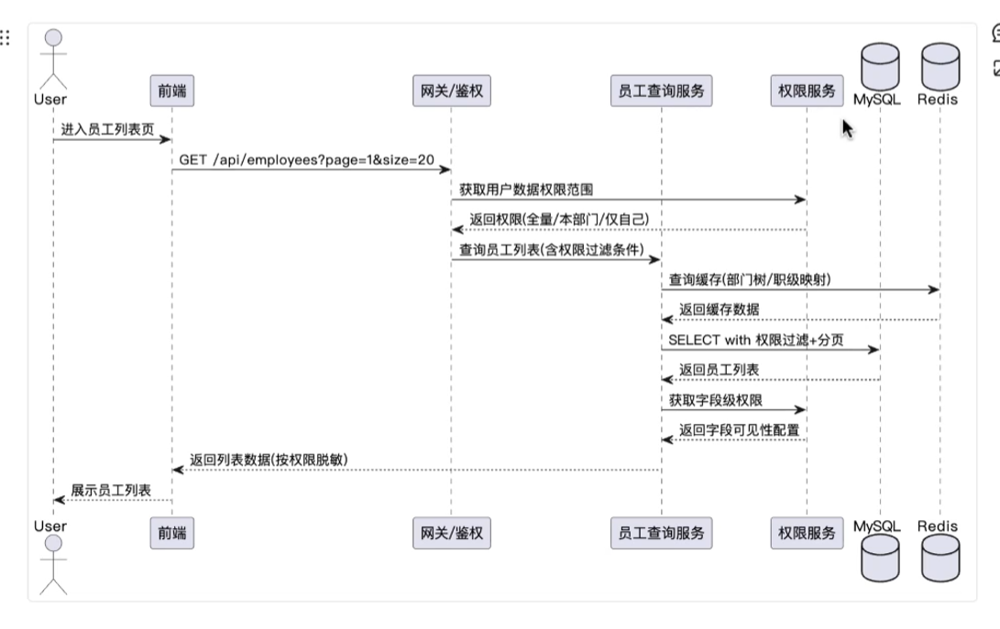
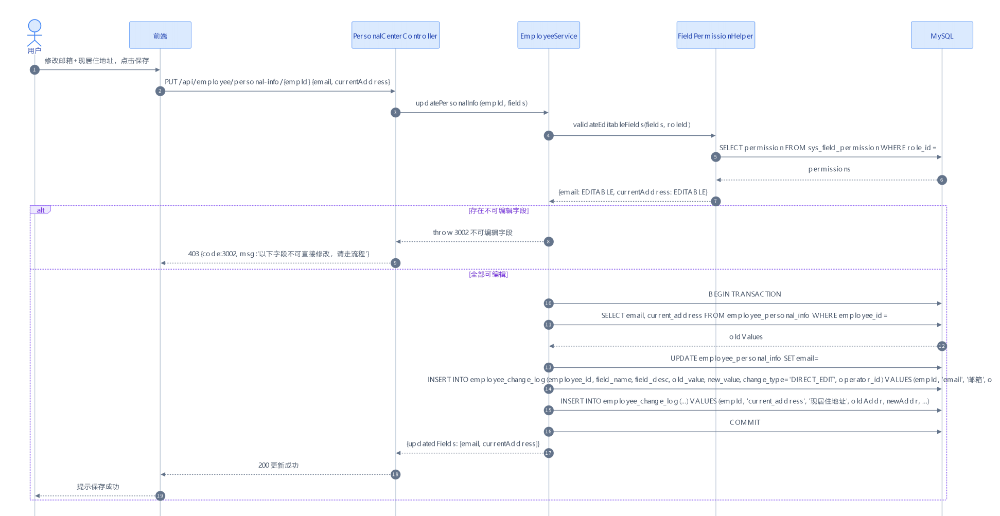
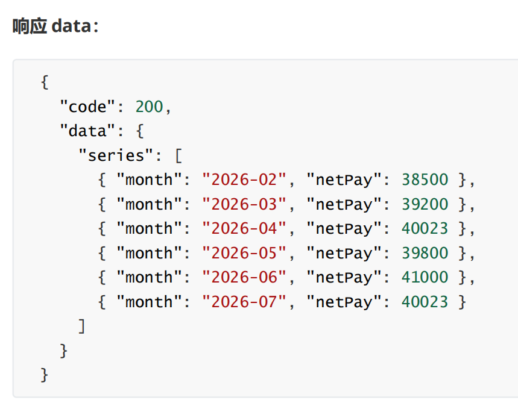
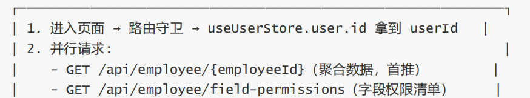

# 后端系分

- 接口文档
- 数据库
- 流程图

# 后端问题

- 时序图上传递时候写文字,不要写具体方法
  - 画图的简介,用中文
    - 示例
    - 
    - 原
      - 
    - 可加上数据库内容, 表结构

# 前端问题

- 用`json`结构返回具体发送了什么数据,接受了什么数据

  - 

- 对应页面使用比较少的情况如`只有两个页面`不用变成组件[`@/components/`]

- 登录时只应该用一次token校验,后续控制直接固定

  - 
  - 这里不应该并行请求, 数据获取有先后顺序, 先访问控制后,数据
  - 聚合数据指的是一次请求页面需要数据都拿到了
  - 这里`field-premissions`是在获取字段,用于前端页面渲染是否更新按钮可点--问题在于这些状态值应该在登录后就加载进来长期存储在多个页面共同使用(`useState`)
  - 登录的权限校验在登录时已经完成

- 层级树级到5机 后,按钮禁用掉

