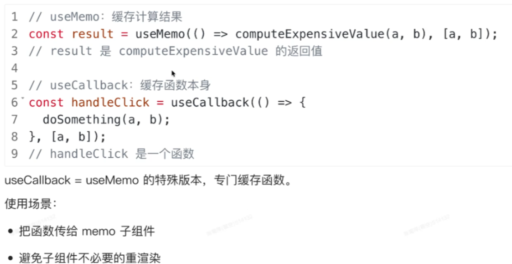
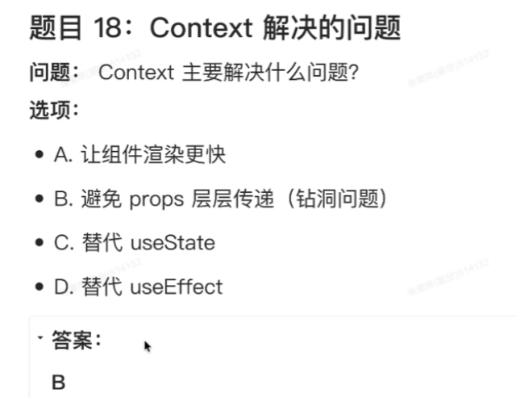
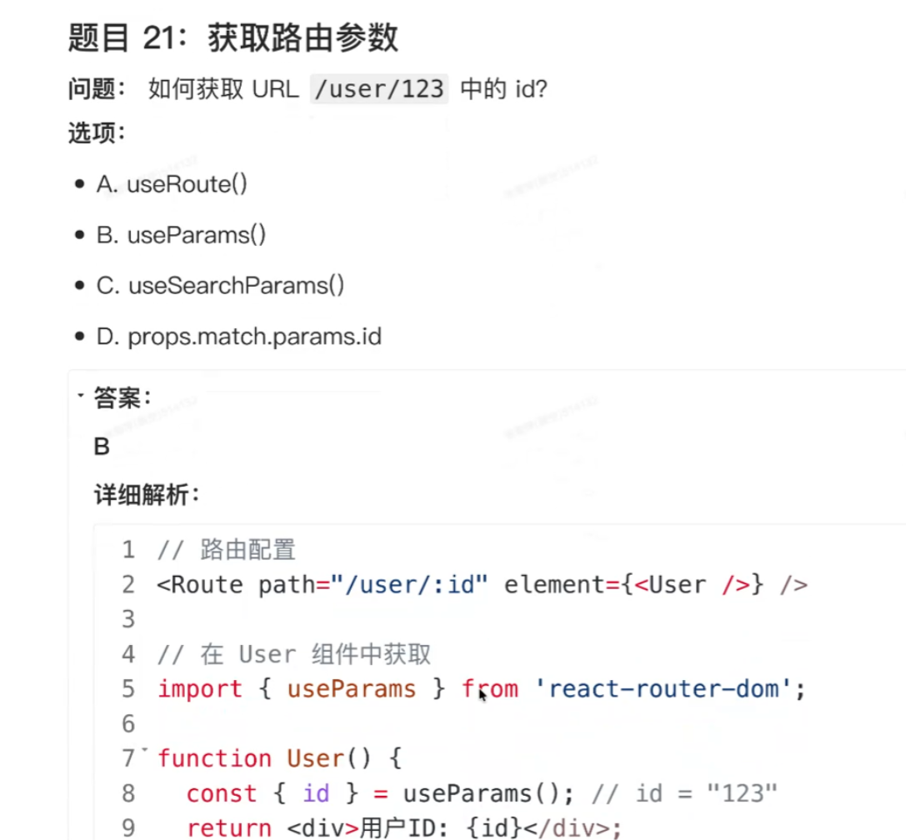

# `useEffect`使用

## 介绍

- 副作用 != `负作用`: 这里的`副`是`其他`的意思,表示除了原有逻辑还会产生其他作用如:

  - 发送网络请求
  - 修改DOM
  - 存储数据到浏览器
  - 启动定时器

- `useEffect()` 是一个管理副作用的函数,里面的`Effect`就表示`副作用`的意思

  - 格式:`useEffect(回调函数, 依赖项数组[可选])` 

    - 当依赖项数组不写,每次组件渲染`useEffect`的回调函数都会执行

    - 组件渲染的时机有:

      > 1. 组件首次挂载
      >
      > 2. 组件内部状态(如:`useState`,`useReducer`)改变时 
      > 3. 父组件因为`2`的原因重新渲染(除非子组件被 `React.memo` 包裹，并且接收到的 `props` 确实没有改变，它才会跳过这次渲染)
      > 4. 通过`useContext`订阅的全局数据源发生了改变

      - `const [state, dispatch] = useReducer(reducer, initialState);` 同样用于管理状态当状态变化逻辑十分复杂时使用

      - `React.momo()`包裹子组件函数时,仅接收的`props`改变时才渲染子组件

        >  这种`props`的改变判断属于浅比较, 若`props`
        >
        > 是对象仅比较对象地址是否改变

        示例: 

        ```react
        const Child = React.memo(({ user }) => {
          console.log("子组件渲染了！");
          return <div>{user.name}</div>;
        }, areEqual);
        ```

        > 而一般const对象当父组件重新渲染时会新建一个对象,地址与原不同因此一般每次都会渲染子组件

      - `React.memo`出错示例

        > 使用 `useMemo(() => {
        > ​    return { name: name, age: 25 };
        >   }, [name]); ` 声明对象,仅当依赖属性变化时才会产生新对象 

      ```
      const Parent = () => {
        const [count, setCount] = useState(0);
        const [name, setName] = useState("张三");
      
        // 只有当 name 变化时，user 的引用地址才会改变
        const user = useMemo(() => {
          return { name: name, age: count };
        }, [name]); 
       // 当count改变由于没有user监听该属性,对象不会更新
        return (
          <div>
            <button onClick={() => setCount(count + 1)}>加 1 (不会触发子组件渲染)</button>
            <button onClick={() => setName("李四")}>改名 (会触发子组件渲染)</button>
            <Child user={user} />  
            // 此处默认Child已被React.memo()包裹
            // 因此当count改变, user地址未变
            // 子组件不重新渲染
          </div>
        );
      };
      ```

    - `useContext()`详解

      `useContext` 是 React 提供的一个 Hook，用于在函数组件中读取 Context 的值。它的主要作用是**跨层级组件传递数据**，避免通过每一层组件手动传递 props（即所谓的 "Prop Drilling" 属性钻取）。
      以下是详细的用法指南：
      ### 1. 基本语法
      ```javascript
      const value = useContext(MyContext);
      ```
      *   **参数**：`MyContext` 是由 `React.createContext` 创建的 context 对象。
      *   **返回值**：该 Context 当前的值（由最近的上层 `<MyContext.Provider>` 的 `value` prop 决定）。
      ---
      ### 2. 完整使用步骤
      使用 `useContext` 通常分为三步：**创建 Context**、**提供数据**、**消费数据**。
      #### 第一步：创建 Context
      在组件外部创建一个 Context 对象。
      ```javascript
      // MyContext.js
      import React from 'react';
      // 创建一个 Context 对象，并可以设置默认值
      export const MyContext = React.createContext('默认值');
      ```
      #### 第二步：提供数据
      在父组件（或者更上层的组件）中使用 `Provider` 包裹子组件，并通过 `value` prop 传递数据。
      ```javascript
      // ParentComponent.js
      import React, { useState } from 'react';
      import { MyContext } from './MyContext';
      import ChildComponent from './ChildComponent';
      export default function ParentComponent() {
        const [theme, setTheme] = useState('dark');
        return (
          // 使用 Provider 包裹，value 中的数据可以被所有后代组件访问
          <MyContext.Provider value={theme}>
            <ChildComponent />
          </MyContext.Provider>
        );
      }
      ```
      #### 第三步：消费数据 (使用 useContext)
      在任意层级的子组件中，使用 `useContext` 钩子来获取数据。
      ```javascript
      // ChildComponent.js (可以是深层嵌套的组件)
      import React, { useContext } from 'react';
      import { MyContext } from './MyContext';
      export default function ChildComponent() {
        // 调用 useContext，传入 Context 对象
        const theme = useContext(MyContext);
        return <div>当前主题是: {theme}</div>;
      }
      ```
      ---
      ### 3. 实战示例：动态切换主题
      这个例子展示了如何在深层组件中获取外层数据，并如何更新它。
      ```jsx
      import React, { createContext, useState, useContext } from 'react';
      // 1. 创建 Context
      const ThemeContext = createContext();
      // 2. 创建一个方便的 Provider 组件（可选，但推荐）
      export function ThemeProvider({ children }) {
        const [theme, setTheme] = useState('light');
        const toggleTheme = () => {
          setTheme(prevTheme => (prevTheme === 'light' ? 'dark' : 'light'));
        };
        // value 可以传递任何值，包括函数
        return (
          <ThemeContext.Provider value={{ theme, toggleTheme }}>
            {children}
          </ThemeContext.Provider>
        );
      }
      // 3. 子组件：使用数据
      const Toolbar = () => {
        // 解构出 theme 和 toggleTheme
        const { theme, toggleTheme } = useContext(ThemeContext);
        return (
          <div style={{ background: theme === 'light' ? '#eee' : '#333', color: theme === 'light' ? '#000' : '#fff', padding: '20px' }}>
            <p>当前模式: {theme}</p>
            <button onClick={toggleTheme}>切换主题</button>
          </div>
        );
      };
      // 4. 应用入口
      export default function App() {
        return (
          <ThemeProvider>
            <Toolbar />
          </ThemeProvider>
        );
      }
      ```
      ---
      ### 4. 重要注意事项
      #### 1. 配合 Provider 使用
      当组件上层没有匹配的 `Provider` 时，`useContext` 返回的值是 `createContext(defaultValue)` 传入的默认值。
      *   **注意**：只有当你**完全没有** Provider 包裹时，才会使用默认值。如果有一个 `Provider` 但其 `value={undefined}`，子组件拿到的就是 `undefined`，而不是默认值。
      #### 2. 性能优化（引用相等性）
      React 使用 `Object.is` 来比较 Context 的值是否发生变化。
      *   如果你传递给 Provider 的 `value` 是一个对象（例如 `value={{ data, setData }}`），每次父组件渲染时都会创建一个**新**的对象引用。
      *   这会导致所有使用了该 Context 的子组件**无条件重新渲染**，即使数据没变。
          **优化方案：**
          如果导致不必要的渲染，可以将 value 拆分，或者使用 `useMemo` 缓存这个对象：
      ```javascript
      const value = useMemo(() => ({ data, setData }), [data]);
      // 或者拆分成两个 Context 分别传递 data 和 setData
      ```
      #### 3. 不要过度使用
      Context 主要用于**全局**或**跨多层**的数据（如用户信息、主题、语言设置）。
      如果只是为了父子两层传递数据，请继续使用 `props`，因为 Context 的机制会使得组件的复用性变差（组件强依赖于特定的 Context）。
      #### 4. 组件层级配合 `useContext`
      `useContext` 必须在组件的**顶层**调用（就像其他 Hooks 一样）。不要在 `if` 语句或 `for` 循环中使用它。
      ### 总结
      1.  **创建**：`const Ctx = createContext()`。
      2.  **提供**：`<Ctx.Provider value={...}>`。
      3.  **使用**：`const val = useContext(Ctx)`。
          这是 React 中解决跨组件数据共享最优雅、最原生的方式。

## `useEffect`的` return` 

- `useEffect`内部函数返回`return`后通常跟清理函数, 	`return`后的语句会再下一次`依赖项变化`或`useEffect`销毁前调用,达到清理目的

- 示例

  ```react
  useEffect(() => {
  	const timer = setInterval(() => {...}， 1000);
  	return () => clearlnterval(timer)  //写上清理函数返回
  	// 这里 return是返回了函数定义, 
      // 在组件销毁或下一次 effect(副作用逻辑) 重新执行前由useEffect调用函数体
                                  }，[])
  ```

- `return`后通常跟清理函数, 或`undefined` , 由于使用`asnyc` 会返回`Promise对象` 因此这种不可以使用

  ```react
  useEffect(async () =>
  const data = await fetch('/api');，[])；//❌️
  ```

- **渲染 (Rendering)**：是 React **计算** UI 应该长什么样（即生成虚拟 DOM 树）的过程。它是一个**纯计算过程**，不涉及任何实际的 DOM 操作。通常`state`变化会使得重新渲染

- **挂载 (Mounting)**：是 React 将**计算好的结果**（虚拟 DOM）**应用到**浏览器真实 DOM 上的过程。这是一个**有副作用的操作**，会改变页面内容。

  - **触发时机**：
    - 渲染阶段计算出需要更新时。
    - 具体来说，当虚拟 DOM 树与真实 DOM 树有差异时，React 就会执行挂载操作。

  - 当依赖项为`[]` 仅在`组件挂载`时执行

    ```react
    useEffect(() => {
      setCount(c => c + 1);
    }, []);
    // setCount触发重新渲染,但组件未必重新挂载
    // 不会死循环，只执行一次
    ```


## `useRef ` 与`useState`

- `场景1`: 当你的组件有 `state` 变化时，组件会重新渲染。在重新渲染的过程中，组件函数会从头到尾重新执行一遍。

  - 因此若组件函数内有对象`const inputEl = { current: null };`每次都是新的
  - 使用`const inputEl = useRef(null);`使得每次渲染都是同一个对象

- `场景2`: `DOM` 挂载时将 DOM 节点赋值给 变量完成操作DOM

  - 示例:

  - ```react
    import React, { useRef } from 'react';
    
    function TextInputWithFocusButton() {
      // 1. 创建一个 ref 对象，初始值为 null
      const inputEl = useRef(null);
    
      const onButtonClick = () => {
        // 3. 点击按钮时，调用原生 DOM API 的 focus 方法
        // 注意：这里的 inputEl.current 指向的就是真实的 <input> DOM 节点
        inputEl.current.focus();
      };
    
      return (
        <>
          {/* 2. 将 ref 对象绑定到 <input> 元素上 */}
          // 通过ref挂载DOM到`inputEl.current`属性
          <input ref={inputEl} type="text" />
          <button onClick={onButtonClick}>Focus the input</button>
        </>
      );
    }
    
    ```

  - **普通对象不会被 React的ref 赋值**：`const inputEl = { current: null };` 创建的是一个普通的 JavaScript 对象。React 的 `ref` 属性虽然接受一个有 `.current` 属性的对象，但 React 内部只对由 `useRef` 或 `createRef` 创建的对象进行特殊处理（即在 DOM 挂载时将 DOM 节点赋值给 `.current`）。对于普通对象，React 不会去维护它的 `.current` 属性，所以 `inputEl.current` 永远是 `null`。

  - **每次渲染重置引用**：每次组件重新渲染时，若是普通对象`const inputEl = { current: null };` 都会执行一遍，生成一个全新的空对象，即使之前被赋过值也会被覆盖。

  - 可变。直接修改 `ref.current = newValue`

### 重要注意事项

- 在react渲染过程中应该是纯函数

  - 纯函数指没有副作用的函数
  - 把修改 `ref` 当作一种“副作用”，把它放到事件中去做：
    - **响应用户操作**：放在 `onClick`、`onChange` 等事件处理函数中。
    - **响应生命周期/状态变化**：放在 `useEffect` 里
      - `useEffect`（Effect 即“副作用”的缩写）里的函数，**一定是在组件把真实 DOM 渲染到屏幕上之后，才会执行的。**

- 因为 React 是**数据驱动视图**的。React 的核心机制是：`State 变化` -> `触发重新渲染` -> `重新生成虚拟 DOM` -> `更新真实界面`。

  - 因此必须用`state`驱动渲染进而在页面显示变化

- 原生标签（如 `<input>`、`<div>`）：可以直接使用 `ref`

  - 对于浏览器原生的 HTML 标签，React 底层明确知道它们对应的是真实的 DOM 节点。不可用`ref`

- 自定义组件（如 `<MyInput />`）：不能直接使用 `ref`

  - 自定义组件本质上是一个**函数**。因此不可以用ref


- 总结:  主要用来抓取 DOM 节点，或者存放那些“组件需要记住、但界面不需要根据它变化”的零碎数据（如 Timer ID、上一次的状态快照等）。

  > 题1: 
  >
  > `useRef` 和`useState`的主要区别是什么？
  >
  > 选项：
  > • A .	`useRef`不能存储数据
  > • B .修改`useRef`的值不会触发页面重新渲染
  >
  > 答案: B

  >

  > 问题：以下哪个最适合用useRef?选项：
  > A.存储要在页面上显示的数字
  > B.存储定时器的ID
  >
  > B

  - > 解析: 在 JavaScript 中，`setTimeout` 函数本身**不返回引用**，而是返回一个**数字类型的定时器 ID**（timer ID）。这个 ID 是一个唯一的标识符，用于后续通过 `clearTimeout` 函数取消对应的定时器。  
    > ### 关键点：  
    > - `setTimeout(callback, delay)` 执行后，返回的 ID 是一个**数字**（例如 `1`、`2` 等），而非“引用”（reference，如对象或函数指针）。  
    > - 这个 ID 的作用是“标记”该定时器，以便后续通过 `clearTimeout(id)` 清除它，防止回调函数执行。  
    >   例如：  
    > ```javascript
    > import React, { useRef, useEffect } from 'react';
    > 
    > function TimerComponent() {
    >   // 1. 创建 useRef，初始值为 null（存储定时器 ID）
    >   const timerRef = useRef(null);
    > 
    >   useEffect(() => {
    >     // 2. 启动定时器，将 ID 存入 timerRef.current
    >     timerRef.current = setTimeout(() => {
    >       console.log('定时器触发');
    >     }, 1000);
    > 
    >     // 3. 清理函数：组件卸载时清除定时器（避免内存泄漏）
    >     return () => {
    >       if (timerRef.current) {
    >         clearTimeout(timerRef.current);
    >       }
    >     };
    >   }, []); // 空依赖数组：仅组件挂载时执行一次
    > 
    >   return <div>定时器示例</div>;
    > }
    > 
    > ```
    > 总结：`setTimeout` 返回的是**定时器 ID（数字）**,定时器 ID 是“非渲染相关”的副作用标识（如 `setTimeout/setInterval` 的返回值），需要跨渲染周期保持，但无需触发 UI 更新。因此使用`useRef`


## 题

> 

> 
>


>
>
> 


## 改错

> 
>
>

> 

> 
>
> 

```react
useEffect(() => {
  if (count >= 10) return; // 终止条件

  const timer = setTimeout(() => {
    setCount(count + 1);
  }, 1000);

  return () => clearTimeout(timer);
}, [count]); // 依赖项是 [count]
// 这个是在每次count变化时都产生一个计数器1s后+1
```

