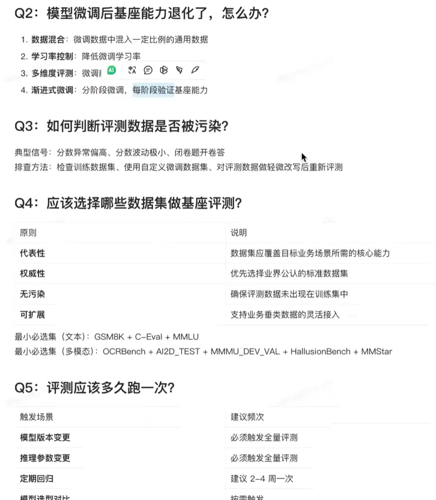
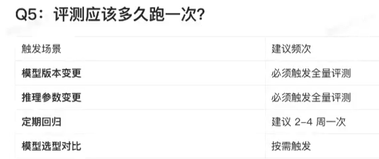
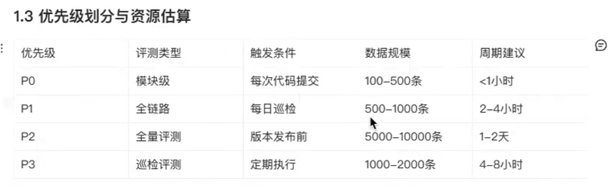
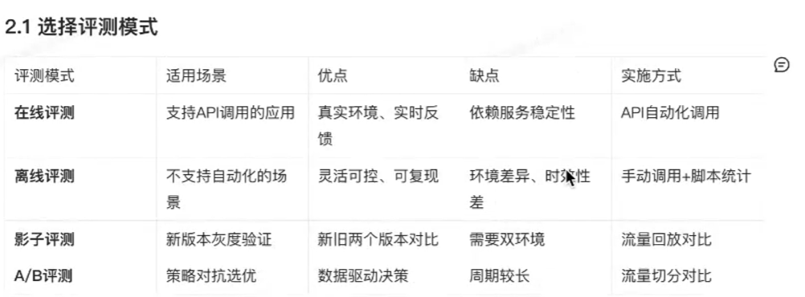
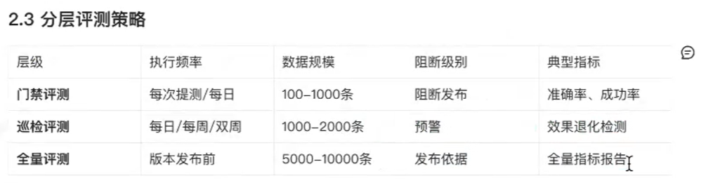
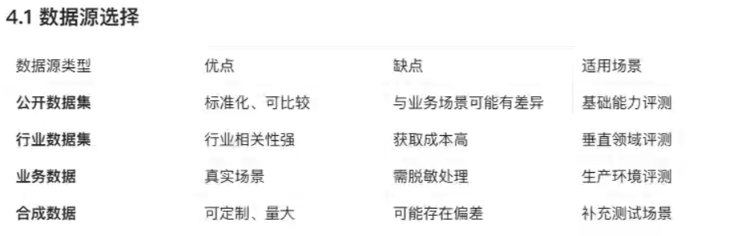
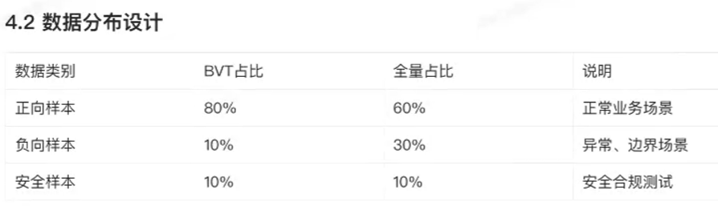
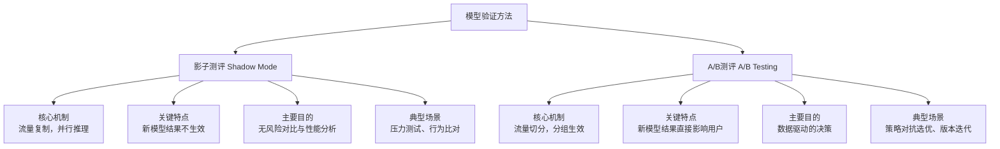

# 直播

## 大模型测评

### 大模型评测体系＆分类

- 基座模型评测(Foundation ModelEvaluation）
  - 定义：针对规模预训练或通用微调后的"基础层"模型（例如通用LLM、多模态模型）进的能画像与风险评估。
  - 目标：衡量模型在广泛任务/领域上的通用能力（理解、生成、常识推理、多模态对齐等)、稳定性与潜在
    风险（幻觉、偏见、泄露）。结果用于模型选择、下游微调决策、基座模型版本管理与治理门槛设定。
- 应用模型评测(Application/Product Model Evaluation）
  - 定义：针对某一具体业务场景（例如客服助、投顾问答、本审核、多模态检索等）基于特定prompt/策略/微调后的模型评测。
  - 目标：验证模型在该业务链路上的最终可用性、业务风险（误导/评操作成本）、用户体验（满意度）以及工程性能（延迟、成本、可用性）。

### 常见评测类型与方法

- 自动化评测：在批量测试集上计算自动指标
- 人工评估(Human Eval)：人工打分、A/B比较或二分类判定
- 混合策略：自动预筛选+人工抽检（推荐用于实践）
- AB实验/赛马：不同基座不同模型赛马评测对比
- 灰度众测：真实用户小流量试验
- 鲁棒/对抗/红蓝攻防：构造扰动或恶意输入测试模型弱点与安全性
- 长期监控：上线后持续跟踪幻觉率、关键KPI、分布漂移与告警

## 分布偏移

在大模型（或任何机器学习模型）的长期监控中，“分布漂移”指的是模型输入数据的**统计特性**或**输入与输出之间的映射关系**随时间发生了变化，从而导致模型性能下降的现象。理解它，是保障模型长期可靠运行的关键。
为了让你快速理解其核心，下图清晰地展示了分布漂移的两种主要类型及其关系：
```flowchart
flowchart LR
    A[分布漂移 Distribution Drift] --> B[数据漂移<br/>Covariate Shift]
    A --> C[概念漂移<br/>Concept Drift]
    
    B --> D[特征分布变化<br/>P(X) 变化]
    B --> E[映射关系不变<br/>P(Y|X) 不变]
    
    C --> F[映射关系变化<br/>P(Y|X) 变化]
    C --> G[特征分布可能不变<br/>P(X) 可能不变]
    
    E --> H[模型性能可能暂未下降]
    G --> I[模型性能必然下降]
```
下面，我们结合上图和搜索结果，详细解释这两种漂移。
### 🔍 核心概念：数据漂移 vs. 概念漂移
#### 1. 数据漂移 (Covariate Shift)
这是最基础、最常见的一种漂移，指的是模型**输入特征 (X) 的分布 p(X) 随时间发生变化**，但**输入特征与目标变量 (Y) 之间的关系 p(Y|X) 保持不变**。
*   **通俗比喻**：就像你训练了一个识别苹果的模型，现在给它看的苹果图片的光照、角度（特征分布）变了，但苹果还是那个苹果（概念未变）。
*   **具体例子**：
    *   **用户年龄分布变化**：电商推荐模型训练时，用户年龄峰值在20-30岁，上线后由于推广活动，新用户年龄峰值移到了40-50岁。
    *   **季节性消费变化**：预测冰淇淋销量的模型，训练数据多集中在夏季，上线后到了冬季，温度、降水量等特征分布发生了变化。
*   **影响**：模型遇到此前未见过的特征组合，可能预测置信度下降，但“正确答案”的逻辑本身没有变。
#### 2. 概念漂移 (Concept Drift)
这是更为棘手和隐蔽的漂移。它指的是**输入特征与目标变量之间的映射关系 p(Y|X) 发生了变化**，即“概念”本身发生了漂移。特征分布 p(X) 可能变，也可能不变。
*   **通俗比喻**：你训练模型识别“苹果”时，苹果是红色的。但后来市场上出现了绿色的“苹果梨”，模型用旧的红色特征判断就会出错——苹果这个概念本身发生了漂移。
*   **具体例子**：
    *   **金融风控场景**：过去，“高收入”是“低信用风险”的强特征。但在经济下行期，部分高收入人群负债率上升，违约风险反而增加，“收入”与“风险”的映射关系变了。
    *   **疫情消费模式**：疫情期间，用户囤积日用品的模式与平时截然不同，导致预测模型失效。
*   **影响**：这是模型“静默失效”的主要原因，因为模型内部的决策逻辑已经过时，必须进行更新。
### 🚨 分布漂移的常见类型与特征
根据变化的速度和形态，概念漂移通常可以分为以下几种类型：
| 类型                             | 描述                                               | 例子                                           | 检测难度                   |
| :------------------------------- | :------------------------------------------------- | :--------------------------------------------- | :------------------------- |
| **突发漂移 (Abrupt Drift)**      | 新旧概念在短时间内发生突然、显著的切换，如同开关。 | 突发政策法规（如防沉迷系统）导致用户行为剧变。 | ★☆☆☆☆ 较易检测，指标会骤变 |
| **渐进漂移 (Gradual Drift)**     | 新旧概念缓慢交替，有一个过渡期。                   | 时尚潮流的演变，某种商品销量缓慢下降。         | ★★★☆☆ 需要持续监控趋势     |
| **增量漂移 (Incremental Drift)** | 概念逐渐、稳定地向一个方向演变。                   | 通货膨胀率稳定地逐年上升。                     | ★★★☆☆ 需要基线校准         |
| **重复性漂移 (Recurring Drift)** | 已经过去的概念可能周期性地重现。                   | 季节性商品（如羽绒服）的销量模式周而复始。     | ★★☆☆☆ 可建模，周期性检测   |
### 🛠️ 分布漂移的检测与监控方法
在生产环境中，构建一套多维度、实时的监控体系是应对漂移的核心。
#### 监控指标选择
有效的监控需超越单一准确率，建立前置指标组合：
*   **输入数据分布指标**：监控关键特征的均值、标准差、分位数，类别特征的占比变化。常用 **PSI (Population Stability Index)** 和 **KS检验** 来量化分布差异。
*   **模型预测结果指标**：监控预测概率分布、预测不确定性的平均水平。不确定性突然升高往往是模型遇到陌生数据的信号。
*   **业务性能指标**：关联真实的业务KPI（如转化率、坏账率），并设置代理指标（如首次还款逾期率）进行早期预警。
#### 检测方法与技术
| 方法                | 原理                                                         | 适用场景                             | 工具/库示例                |
| :------------------ | :----------------------------------------------------------- | :----------------------------------- | :------------------------- |
| **统计检验法**      | 通过KS检验、卡方检验等判断两个分布是否相同。                 | 监控单个特征分布漂移。               | `scipy.stats`, `Evidently` |
| **距离/散度度量法** | 计算训练集与线上数据分布的距离，如KL散度、JS散度、Wasserstein距离。 | 量化整体分布漂移程度。               | `scipy.stats`, `NumPy`     |
| **自适应窗口法**    | 维持一个动态窗口，当窗口内数据分布与历史基线差异超过阈值时报警。 | 检测突发漂移，平衡检测速度与稳定性。 | `river`库的ADWIN算法       |
| **对抗验证法**      | 训练一个分类器区分训练集与线上数据，若分类器性能过高，说明存在漂移。 | 自动化检测并定位漂移特征。           | 自定义逻辑或`HyperGBM`     |
> 💡 **实战提示**：初期建议聚焦5-10个核心特征和1-2个核心业务指标进行监控，避免资源浪费。同时，**不要使用训练集数据作为永恒基线**，更合理的做法是将模型上线后最初一段稳定期的数据定义为“参考基线窗口”。
### 🔄 漂移发生后的应对与治理
检测到漂移后，需要建立分级响应机制：
1.  **轻量级响应**：**特征分箱重校准**、**加入时间衰减权重**、触发**增量学习**。
2.  **中度响应**：**模型重训练**，使用最新数据更新模型。
3.  **重度响应**：**特征工程迭代**，甚至**模型架构升级**，以适应根本性的概念变化。
    对于大模型而言，还需要关注其特有的漂移，如**知识截止日期**导致的性能退化，或因**用户提问模式**变化而导致的对齐漂移。
### ✅ 总结
**分布漂移**是模型在真实世界中“悄悄变笨”的隐形杀手，主要分为：
*   **数据漂移 (Covariate Shift)**：特征分布变化，概念不变。
*   **概念漂移 (Concept Drift)**：特征与目标的映射关系变化，概念改变。
    构建**监控体系**是防线，核心是**持续监控特征分布、模型输出与业务KPI**，并采用**统计检验、散度度量**等技术进行检测。最终目标是建立**从告警到根因分析再到模型更新的自动化闭环治理流程**，确保模型在动态变化的环境中持续提供可靠价值。
*   模型变,但是需要模型应用的场景改变了,即`过时了`

# 下半场

##  常见模型测评知识

- 算力与成本压力

  - 训练/部署成本高，落地ROI不确定
    - **ROI** 是 **Return on Investment** 的缩写，中文译为 **“投资回报率”**

- `自测`VS`EVE榜单` 

  - 分析自己数据集与标准的数据集的不同
  - 自测精度分与 EVE 榜单公开分数的偏差，超过3%需排查原因

- Q3：如何判断评测数据是否被污染？
  典型信号：分数异常偏高、分数波动极小、闭卷题开卷答
  排查法：检查训练数据集、使用自定义微调数据集、对评测数做轻微改写后重新评测
  工

- 

- 

- 以上都很好


##  测评数据污染含义

**测评数据被污染**（Evaluation Data Contamination），在大模型领域通常简称为**“数据泄漏”**，指的是**用于评测模型能力的数据集（考题），在模型训练阶段就已经被模型“见过”或“背过”了**。
这就像是学生在考试前偷到了答案，或者把考题当作练习题做了一遍。这种情况下，模型在评测集上取得的高分，并不代表其真实的泛化能力或智力水平，而仅仅是记住了特定数据的“标准答案”。
以下是关于“测评数据被污染”的详细解读：
### 1. 核心本质：训练集与测试集的重叠
在理想的机器学习流程中，训练数据（学习材料）和测试数据（考试题）应该是严格隔离的。
*   **未污染（正常情况）**：模型通过学习教材（训练数据）掌握通用的知识和逻辑，然后去解答从未见过的考题（测试数据），以此检验真实水平。
*   **被污染（泄漏情况）**：考题（测试数据）本身就混在了教材（训练数据）里。模型在训练时一遍遍地“看”到了这些题目和答案。
### 2. 为什么这很严重？
数据污染会导致**“虚高”的评测分数**，从而误导开发者或用户。
*   **虚假繁荣**：模型看起来非常聪明，排行榜分数极高，但实际落地应用时，面对用户提出的真实、未见过的问题，表现可能一塌糊涂。
*   **能力误判**：你可能以为模型学会了“举一反三”的逻辑，实际上它只是学会了“死记硬背”。
*   **不公平对比**：那些严格遵守数据隔离规范训练出的模型，可能会因为分数“较低”而被不公平地淘汰。
### 3. 典型的污染场景
污染通常不是开发者故意为之，而是在数据清洗、收集或处理过程中意外发生的：
*   **直接泄漏**：评测集（如GSM8K数学题、HumanEval代码题）被错误地打包进了预训练语料库（如Common Crawl）中。
*   **变体泄漏**：评测题目的变种出现在训练数据中。例如，评测题是“1+1=？”，训练数据中有“1加1等于2”。
*   **指令微调阶段混入**：这是最容易忽视的环节。在做有监督微调（SFT）时，为了追求特定任务的表现，不小心将测试集的数据作为微调指令喂给了模型。
### 4. 如何理解你提到的“典型信号”？
你列出的三个信号正是识别污染的关键线索：
*   **分数异常偏高**：
    *   *解读*：如果一个模型在某个公认高难度的任务上（如复杂的逻辑推理），分数突然大幅超越同类竞品，或者达到了不可思议的高分（如99%准确率），极大概率是“做过原题”。
*   **分数波动极小**：
    *   *解读*：正常模型在面对不同批次的新题目时，分数会有正常的波动。但如果模型“背下了答案”，无论怎么测，分数都极其稳定地维持在高位，因为对它来说这不是在做题，而是在复述记忆。
*   **闭卷题开卷答**：
    *   *解读*：这是指模型回答出了它“不该知道”的细节。例如，评测集包含了一些非常冷门或最新发布的新闻细节，模型却完美复述了原文；或者模型在回答“请补全这段代码”时，连原仓库中特有的注释风格、非功能性的空行都与开源代码库完全一致——这明显说明它“看过”源代码，而不是自己写出来的。
### 5. 如何排查与验证？
你提到的排查方法具体执行逻辑如下：
1.  **检查训练数据集（重奏审查）**：
    *   使用哈希匹配或模糊匹配算法，扫描训练语料库，看是否存在与评测集高度重合的文本。这是最直接的手段。
2.  **对评测数据做轻微改写后重新评测（数据增强测试）**：
    *   *原理*：死记硬背的模型最怕题目变样。
    *   *操作*：把评测题目的题干换一种说法，或者把逻辑等价的条件稍微改动一下（例如把“小明有5个苹果”改成“小红有5个梨”）。
    *   *结果判断*：如果模型在原题上得分很高，但在改写后的题目上得分断崖式下跌，说明之前的高分是靠记忆（污染）得来的，而不是靠逻辑能力。
3.  **使用自定义微调数据集（ withheld held-out set）**：
    *   *原理*：既然公开的评测集可能已经“脏”了（被很多模型用来训练），那就自己造一套从未公开过的“新考卷”。
    *   *操作*：构建全新的、从未在互联网上出现过的问题集（例如企业内部的私有数据）进行测试。这能有效测出模型的“裸泳”成绩。
### 总结
**测评数据被污染 = 考题泄露给考生。**
在大模型时代，由于训练数据量巨大（万亿Token级别），想要完全避免数据重叠非常困难。因此，现在的趋势是**不仅要看榜单分数，更要看抗干扰能力、改写后的表现以及在未知数据上的泛化能力**。只有经得起“改写测试”的高分，才是真实的能力体现。

# 业务测评SOP

> **业务测评SOP** 是 **“业务测评标准作业程序”** 的简称，它是一套将大模型或AI应用的业务测评过程进行**标准化、流程化和规范化**的操作指南

## 基础指标知识

> 

> 
>
>

> 
>
> 1. 发的时候门禁卡一下
>
> 2. 之后定期巡查效果
>
> 3. 更新的时候需要彻底检查

## 其他知识

- 训练数据来源

  > 

- 正常指标报告应该有这几部分:

  - 整体指标概览、分类别指标分解、未达标指标分析

- 模型知识扩充方法

  - **SFT** 是 **Supervised Fine-Tuning** 的缩写，中文译为 **“监督微调”**csdn.net+2。它是大模型从“通用知识学习者”转变为“专业任务执行者”的关键一步。

- 不同测试类型用例占比

  - > 

  - BVT概念：

    > 1. **测试时机**：在开发人员完成代码提交并生成新版本后立即进行
    > 2. **主要目的**：验证软件构建版本的基本功能完整性和主要特性正确性
    > 3. **测试特点**：
    >    - 运行时间短，验证基本功能
    >    - 覆盖率相对较低
    >    - 也被称为"冒烟测试"
    >    - 如果BVT失败，通常意味着版本存在严重问题，需要开发人员立即修复
    > 4. **测试内容**：
    >    - 业务流测试
    >    - 关键功能测试
    >    - 应用程序启动测试
    >    - 产品设置测试

## 测评模式讲解

在模型验证和上线过程中，“影子测评”（Shadow Mode）和“A/B测评”（A/B Testing）是两种核心的对比验证方法，它们目的相似但**实施方式、风险和适用场景截然不同**。
为了让你快速把握核心区别，以下是对两种方法的对比总结：

下面，我们结合上图和搜索结果，详细解读这两种方法。
### 🕵️ 影子测评 (Shadow Mode)
影子测评是一种**低风险、甚至无风险**的验证方式，主要用于新模型的“安全测试”。
*   **核心机制**：将生产环境中的**真实流量复制一份**，同时发送给**当前稳定运行的旧模型**和**待验证的新模型**。旧模型的处理结果正常返回给用户，而新模型的处理结果仅被记录和存储，**不会实际影响用户的业务流程或界面**。
*   **关键特点**：
    *   **完全无风险**：由于新模型的结果不生效，用户感知不到任何变化，不会因新模型的问题导致业务损失。
    *   **并行对比**：可以在成千上万的真实请求下，精确对比两个模型的输出差异、响应时间、资源消耗等。
    *   **数据丰富**：收集到的是真实、多样的业务数据，能暴露离线测试无法发现的问题。
*   **主要目的**：
    1.  **行为比对**：分析新旧模型输出是否高度一致，分歧主要出现在哪些特征或用户群体上。
    2.  **压力测试**：验证新模型在生产环境下的性能（如延迟、吞吐量）是否达标。
    3.  **收集失败案例**：系统性地记录新模型表现不佳的案例，用于后续优化，形成“失败样例池”（Error Bank）。
*   **典型场景**：新模型首次上线前、重大版本更新前、需要评估模型风险但绝不能影响用户体验时。
### 🧪 A/B测评 (A/B Testing)
A/B测评是一种**高风险、高回报**的验证方式，用于通过真实用户数据驱动决策。
*   **核心机制**：将生产环境中的**真实流量按照一定比例（如5%:95%）随机、正交地切分**到两个不同的版本：A组（对照组，使用旧模型）和B组（实验组，使用新模型）。两个模型的处理结果**都会实际生效并影响用户**，最终通过关键业务指标（如点击率、转化率、用户留存）的差异来判断优劣。
*   **关键特点**：
    *   **直接生效**：新模型的结果直接影响用户体验，因此存在风险，需要密切监控指标，并准备快速回滚。
    *   **数据驱动**：基于真实用户行为数据进行统计分析（如假设检验），判断性能差异是否显著，从而做出客观决策。
    *   **周期较长**：为了获得具有统计意义的结果，需要运行足够长的时间以积累足够的样本量。
*   **主要目的**：
    1.  **策略对抗选优**：对比不同模型、不同算法策略、不同提示词模板在实际业务中的效果。
    2.  **功能迭代验证**：验证新功能（如新的推荐算法、新的回复风格）是否能提升业务指标。
    3.  **数据驱动决策**：消除产品或模型迭代中的主观争议，用数据说话。
*   **典型场景**：新模型版本灰度发布、对比两种不同的推荐策略、测试新的对话风格、优化广告点击率等。
### 📊 核心差异总结
| 对比维度         | 影子测评 (Shadow Mode)                       | A/B测评 (A/B Testing)                            |
| :--------------- | :------------------------------------------- | :----------------------------------------------- |
| **结果是否生效** | 新模型结果**不生效**，用户无感知             | 新模型结果**生效**，直接影响用户                 |
| **风险程度**     | **极低**，完全安全可控                       | **中等偏高**，可能影响用户体验或业务指标         |
| **对比方式**     | **并行双跑**，同一流量同时对比两个模型       | **分流对比**，不同流量组分别使用不同模型         |
| **核心目的**     | 无风险验证、性能分析、收集问题               | 数据驱动决策、效果对比、策略优选                 |
| **实施复杂度**   | 较高，需流量镜像、双倍资源投入               | 中等，需流量分流、埋点统计、分析系统             |
| **典型比喻**     | **“考试真题模拟”**，做完题对答案，不影响成绩 | **“分组教学实验”**，不同组用不同方法，比最终成绩 |
### 💡 如何选择与实践建议
1.  **选择顺序**：通常，在引入新模型时，会**先进行影子测评**，确认其无明显性能问题、错误或风险后，**再进行A/B测评**，逐步扩大流量权重，最终完成灰度发布。这是一个“先验证安全，再验证效果”的稳健路径。
2.  **实践要点**：
    *   **流量切分**：A/B测试必须确保分流算法的随机性和一致性（如同一用户始终命中同一组），以保证实验公平性。
    *   **指标监控**：无论是影子模式还是A/B测试，都需要建立完善的监控体系，实时跟踪业务指标、技术指标（延迟、错误率）和模型特定指标（如准确率、幻觉率）。
    *   **统计显著性**：A/B测试的结论必须经过统计检验（如T检验、卡方检验），确保观察到的差异不是由随机波动引起的。
        总而言之，**影子测评是“安全第一”的并行验证，A/B测评是“效果至上”的分组实验**。两者结合，构成了模型在生产环境中科学迭代、稳健上线的关键方法论。

- 