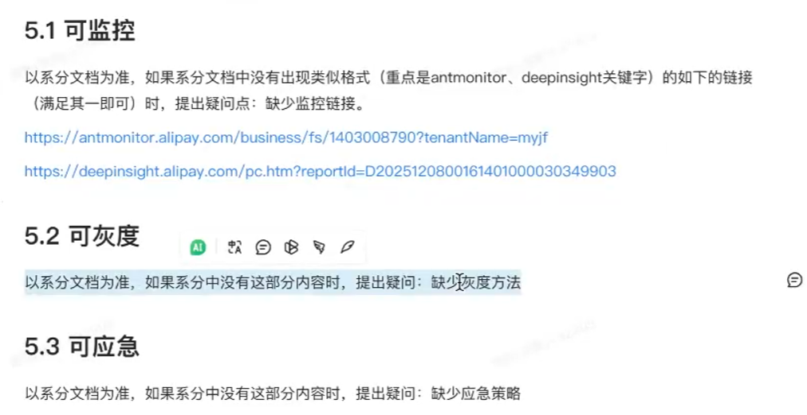
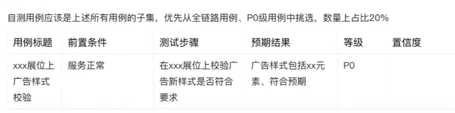

# 广告业质量实例讲解

- 常用的三板斧概念

  - 
  - 灰度指的是逐步发布, 平滑过度

- 置信度: 

  - **“置信度”** 指的是**对该测试用例执行结果的可信程度、可靠性或覆盖该场景的把握程度**。

    它通常用于评估这个测试点是否能真实、稳定地验证出被测功能是否正常。在自动化测试或功能测试矩阵中，置信度的高低直接决定了这个测试用例的价值。

  - 

- 