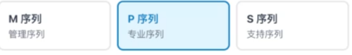
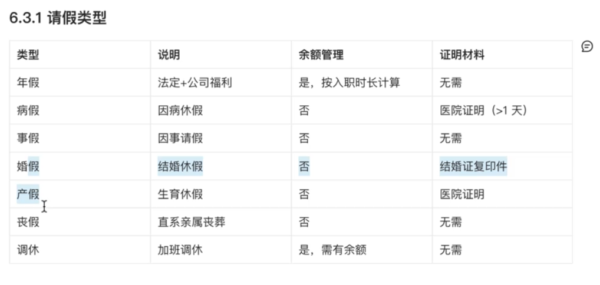
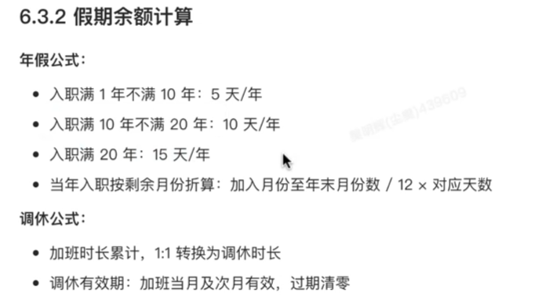
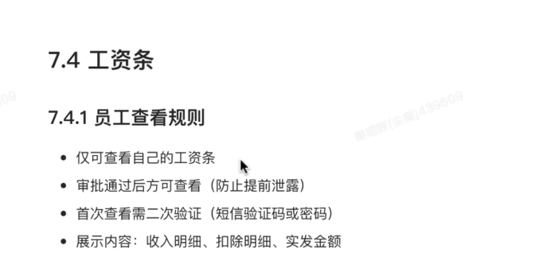
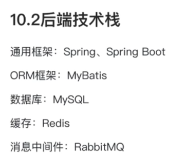
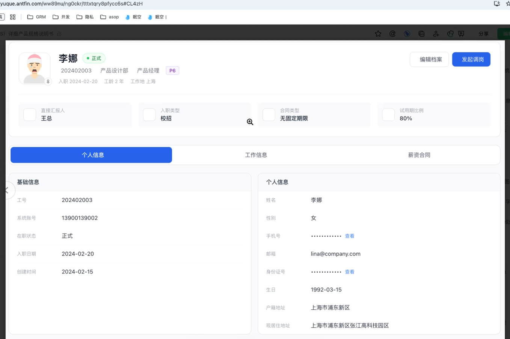
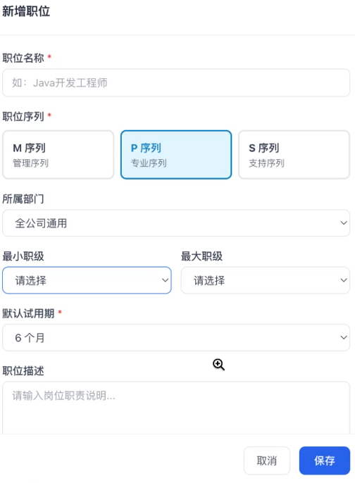
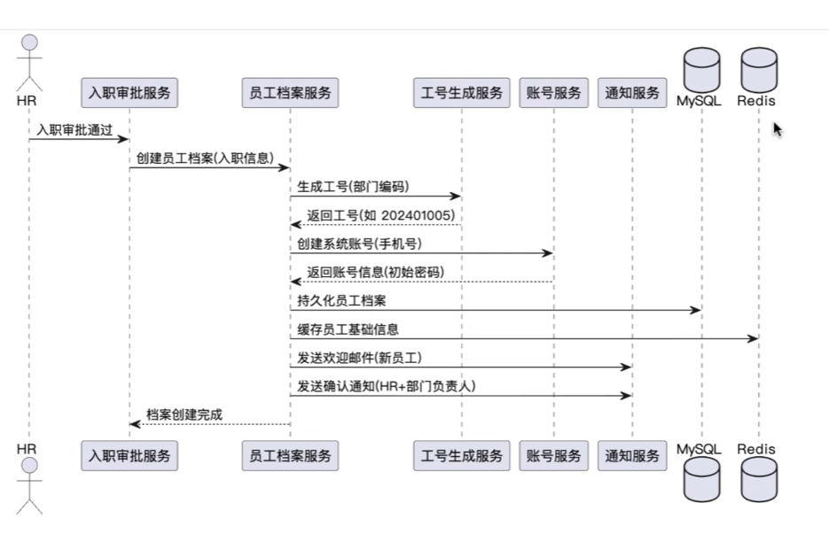
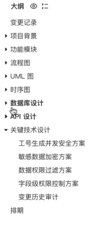

# 人事管理系统HRMS

>  

> 

> 

> 

> nginx 分布式服务?

> 

# 前端

> 
>
> 权限校验
>
> 三个接口三个tab

> 数据刷新存储
>
> 

> 按导航拆

# 后端



> 一次接口多个踏步渲染

> 联调-> 质量验收 -> pd预发 -> 灰度预发 -> 发布 
>
> 灰度,回滚

> 

> 质量: 后端出错前端兜底

> 考勤,薪资,细分

> 做个小细分

> ````
> [钉子]前端技术栈约束
> 请使用以下标准化技术栈进行开发，红色为硬性要求，其余可根据场景自由选用
> 框架：https://zh-hans.react.dev/learn （不要 Vue !! ）、https://umijs.org/
> 语言：TypeScript（推荐）、JavaScript
> 请求库：https://umijs.org/docs/max/request#request 、https://tanstack.com.cn/query/latest 、https://www.axios-http.cn/
> 组件库：https://ant.design/index-cn/?locale=zh-CN 、https://ant-design-charts.antgroup.com/、ECharts
> 第三方库：lodash、dayjs、moment
> 路由库：https://reactrouter.com/
> 状态管理：https://zustand.nodejs.cn/docs/getting-started/introduction （推荐）、https://cn.redux.js.org/
> 样式：css、https://less.bootcss.com/ （推荐）、https://www.sass.hk/docs/index.html
> ````
>
>

